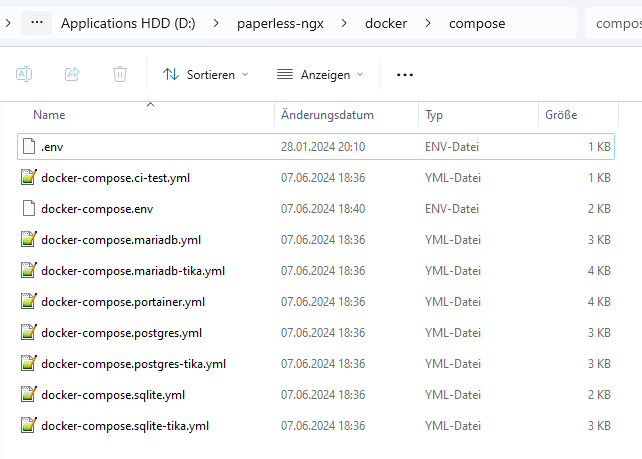

# 🍃 Paperless-ngx

### Prerequisits

***


This guide assumes you already have Docker installed. If not, see the official Docker installation instructions at [https://docs.docker.com/engine/install/](https://docs.docker.com/engine/install/)


:whale: Docker

:coffee: Cup of Coffee

Optional:

GitHub Desktop

### Installation

***

#### Download from GitHub

Go to [https://github.com/paperless-ngx/paperless-ngx](https://github.com/paperless-ngx/paperless-ngx) on [**GitHub**](#user-content-fn-1)[^1] to get the latest files for [**paperless-ngx**](#user-content-fn-2)[^2].

<figure><figcaption><p>The screenshot displays the GitHub repository page for the paperless-ngx project, showing the "dev" branch with various folders and files, along with options to clone the repository using HTTPS, SSH, or GitHub CLI, and options to open it with GitHub Desktop or download it as a ZIP file.</p></figcaption></figure>

Click on the green "Code" button. Choose "Open with GitHub Desktop" if you have [**GitHub Desktop**](#user-content-fn-3)[^3] installed. Otherwise, choose the "Download ZIP" option.



<figure><figcaption><p>This dialog is what you should see after you've pressed the "Open with GitHub Desktop" option</p></figcaption></figure>

Change the local path to your liking if you want to. Then click the blue "Clone" button.

<figure><figcaption><p>This overview is what you should see after you've pressed the blue "Clone" button. The screenshot shows the GitHub Desktop application interface with the paperless-ngx repository open and offering options to open the repository in an external editor, view the files in Explorer, or open the repository on GitHub.</p></figcaption></figure>

You should see this overview after it has finished downloading successfully. To continue, we press the "Show in Explorer" button.







#### Explorer


For detailed instructions, refer to the official paperless-ngx installation guide at [https://docs.paperless-ngx.com/setup/#docker\_hub](https://docs.paperless-ngx.com/setup/#docker\_hub)


\[Insert Introduction]&#x20;

<figure><figcaption><p>This is what you should see after pressing the "Show in Explorer" Button or opening the .zip file. The screenshot displays the directory structure and configuration files of the paperless-ngx project, its organization into folders for various components and a variety of configuration files for development tools and settings.</p></figcaption></figure>

Navigate to the `docker > compose` directory. For example, you can find it at `D:\paperless-ngx\docker\compose\`. This folder contains various Docker Compose files and related configurations essential for deploying and managing services using Docker.

<figure><figcaption><p>The screenshot shows the overview of the "compose" folder.</p></figcaption></figure>

Each [**.yml**](#user-content-fn-4)[^4] file is a different installation setup with different requirements and databases. Which setup you take depends on your taste. Since i'll be using a simple [**sqlite**](#user-content-fn-5)[^5] as the database im choosing "docker-compose.sqlite.yml" for this guide. Open "docker-compose.sqlite.yml" in your favorite text editor (For example [**Notepad++**](#user-content-fn-6)[^6]).

Find the following part in the text file:


```
volumes:
      - data:/usr/src/paperless/data
      - media:/usr/src/paperless/media
      - ./export:/usr/src/paperless/export
      - ./consume:/usr/src/paperless/consume
```


To change the paths, remove the "./" and edit the path to your desired destination. The following shows my config to save the data directly on [**OneDrive**](#user-content-fn-7)[^7].

```
volumes:
      - D:\OneDrive\Anwendungen\paperless\data:/usr/src/paperless/data
      - D:\OneDrive\Anwendungen\paperless\media:/usr/src/paperless/media
      - D:\OneDrive\Anwendungen\paperless\export:/usr/src/paperless/export
      - D:\OneDrive\Anwendungen\paperless\consume:/usr/src/paperless/consume
```

Save your changes and close the file. Now rename "docker-compose.sqlite.yml" to "docker-compose.yml".

\[Explain docker-compose.env]

Modify `docker-compose.env` following the comments in the file. The most important change is to set `USERMAP_UID` and `USERMAP_GID` to the uid and gid of your user on the host system. Use `id -u` and `id -g` to get these.

Run `docker compose pull`

<figure><figcaption><p>Downloading required files.</p></figcaption></figure>

Run `docker compose run --rm webserver createsuperuser`

Run `docker compose up -d`

### Backup

***

All important files (including the database) will be automatically uploaded to OneDrive (as long as OneDrive is set up correctly and running). To restore the data on a new install, simply point to paths again, like

```
volumes:
      - D:\OneDrive\Anwendungen\paperless\data:/usr/src/paperless/data
      - D:\OneDrive\Anwendungen\paperless\media:/usr/src/paperless/media
      - D:\OneDrive\Anwendungen\paperless\export:/usr/src/paperless/export
      - D:\OneDrive\Anwendungen\paperless\consume:/usr/src/paperless/consume
```

and paperless-ngx/Docker will do the rest.

### Update Paperless

***

To update paperless, do the following:

* [ ] Download the latest project files from GitHub.
* [ ] Go to "\paperless-ngx\docker\compose\docker-compose.sqlite.yml" and edit this file to your liking.
* [ ] Rename this file as 'docker-compose.yml'&#x20;
* [ ] Run `docker compose pull`.
* [ ] Run `docker compose up -d`.

### Troubleshooting

***

[^1]: 

[^2]: 

[^3]: 

[^4]: 

[^5]: 

[^6]: 

[^7]: 
