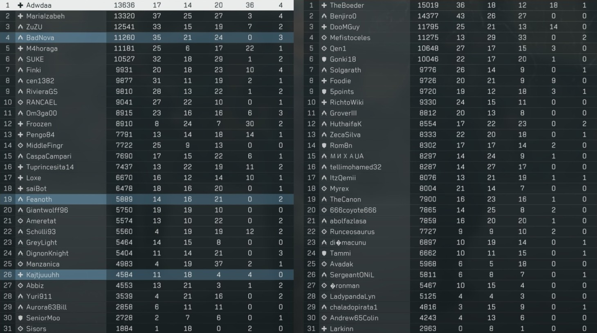
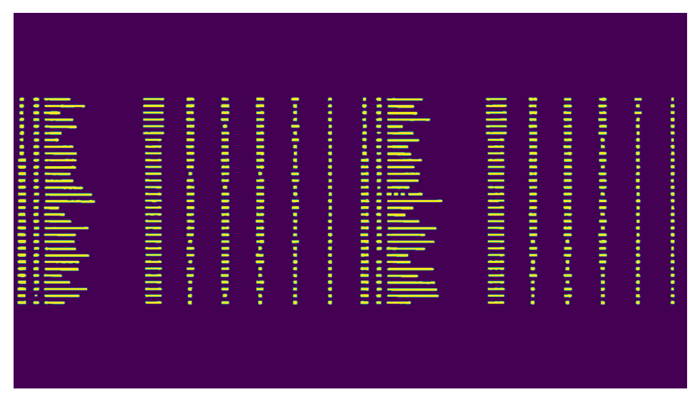
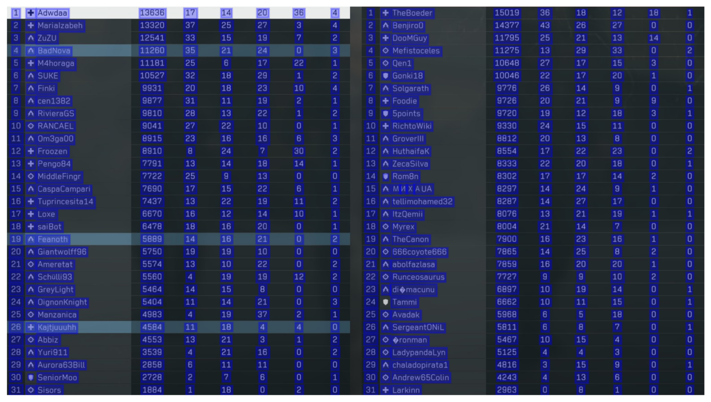
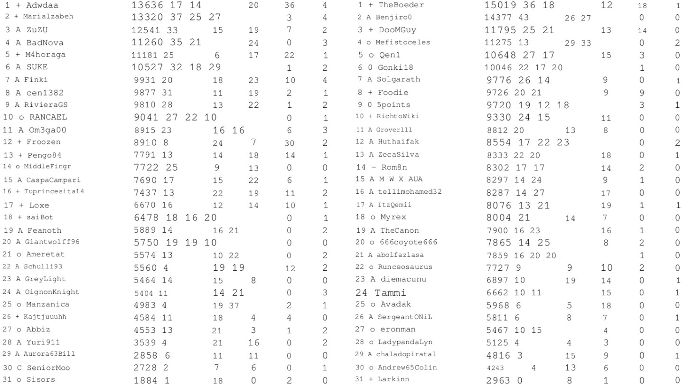

# Untitled

From what I understand, the three primary OCR libraries available for Python are Tesseract, EasyOCR, and docTR.

My testing has shown that docTR is the most efficient option, as it is easy to set up and delivers near-perfect results with minimal adjustments. It doesn't require any typical grayscaling, inverting etc.

Here is a simple script:

```python
pip install python-doctr
```

```python
from doctr.io import DocumentFile
from doctr.models import ocr_predictor

# Initialize the OCR predictor #Fast_base is a good detector in my tests
# https://huggingface.co/spaces/mindee/doctr
predictor = ocr_predictor(det_arch='fast_base', reco_arch='crnn_vgg16_bn', pretrained=True)

# Modify the binarization threshold and the box threshold (optional)
predictor.det_predictor.model.postprocessor.bin_thresh = 0.3
predictor.det_predictor.model.postprocessor.box_thresh = 0.1

# Image path
img = DocumentFile.from_images(image.png)

# Analyze
result = predictor(img)

# Visualize the predictions (optional)
result.show()

# Plain Text Export
text_output = result.render() 
print(text_output)
```

<figure><figcaption><p>Input Image</p></figcaption></figure>

<figure><figcaption><p>docTR Segmentation Heatmap</p></figcaption></figure>

<figure><figcaption><p>docTR OCR output</p></figcaption></figure>

<figure><figcaption><p>docTR Page reconstruction</p></figcaption></figure>
